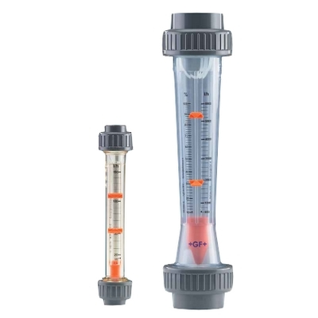

# Flow Measurement

***Definition*** :
Flow measurement is the quantification of bulk fluid or gas movement.

***Units of Measurement***

Volumetric flow rate is sometimes measured in "standard cubic centimeters per minute" (abbreviation sccm), a unit acceptable for use with SI. The SI standard would be m3/s with temperature and pressure specified.

Other units used include gallons (U.S. liquid or imperial) per minute, liters per second, bushels per minute, and acre-feet per day.

***Why is Flow Measurement necessary?***

Accurate measurement of flow rate of liquids and gases is an essential requirement for
maintaining the quality of industrial processes. In fact, most of the industrial control loops control the flow rates of incoming liquids or gases in order to achieve the control objective. As a result, accurate measurement of flow rate is very important.

Needless to say that there could be diverse requirements of flow measurement, depending upon the situation. It could be volumetric or mass flow rate, the medium could be gas or liquid, the measurement could be intrusive or nonintrusive, and so on. As a result there are different types of flow measuring techniques that are used in industries.

***Measurement of Flow***

Flow meter is a device that measures the rate of flow or quantity of a moving fluid in an open
or closed conduit. Flow measuring devices are generally classified into four groups.

They are :
1. *Mechanical type flow meters* : Fixed restriction variable head type flow meters
using different sensors like orifice plate, venturi tube, flow nozzle, pitot tube, dall tube, quantity meters like positive displacement meters, mass flow meters etc. fall under mechanical type flow meters.
2. *Inferential type flow meters*: Variable area flow meters (Rotameters), turbine
flow meter, target flow meters etc.
3. *Electrical type flow meters* :Electromagnetic flow meter, Ultrasonic flow meter,
Laser doppler Anemometers etc. fall under electrical type flow meters.
4. *Other flow meters* :Purge flow regulators, Flow meters for Solids flow measurement, Cross-correlation flow meter, Vortex shedding flow meters, flow switches etc.

***Types of Flow Measuring Instruments used in Industries***

* **Orifice Flow Meter**

An Orifice flow meter is the most common head type flow measuring device. An orifice
plate is inserted in the pipeline and the differential pressure across it is measured.

*Principle of Operation* :
The orifice plate inserted in the pipeline causes an increase in flow velocity and a corresponding decrease in pressure. The flow pattern shows an effective decrease in cross section
beyond the orifice plate, with a maximum velocity and minimum pressure at the vena contracta.

The flow pattern and the sharp leading edge of the orifice plate (Fig. 1.3) which produces it are of major importance. The sharp edge results in an almost pure line contact between the plate and the effective flow, with the negligible fluid-to-metal friction drag at the boundary.

 

There are three types of orifice plates namely

1. Concentric
2. Eccentric and
3. Segmental type.

 

 *Fig : Sketch of Orifices of Different Types*

* **Venturi Tubes**

Venturi tubes are differential pressure producers, based on Bernoulli’s Theorem. General performance and calculations are similar to those for orifice plates. In these devices, there is a
continuous contact between the fluid flow and the surface of the primary device.

*Classic Venturi Construction : [Long Form Venturi]* :
The classic Herchel Venturi tube consists of a cylindrical inlet section equal to the pipe diameter ; a converging conical section in which the cross sectional area decreases causing the velocity to increase with a
corresponding increase in the velocity head and a decrease in the pressure head ; a cylindrical
throat section where the velocity is constant so that the decreased pressure head can be measured ; and a diverging recovery cone where the velocity decreases and almost all of the original pressure head is recovered. The unrecovered pressure head is commonly called as head loss.
*This flow meter is limited to use on clean, non-corrosive liquids and gases, because it is impossible to clean out or flush out the pressure taps if they clog up with dirt or debris.*

 

 *Fig: Long Form Venturi Meters*

 *Short Form Venturi Tubes* :
 In an effort to reduce costs and laying length, manufactures developed a second generation, or short-form venturi tubes.

 There were two major differences in this design. The internal annular chamber was
 replaced by a single pressure tap or in some cases an external pressure averaging chamber, and the recovery cone angle was increased from 7 degrees to 21 degrees. The short form venturi tubes can be manufactured from cast iron or welded from a variety of materials compatible with the application.

  

  *Fig: Short Forms Venturi Tubes*

 The pressure taps are located one-quarter to one-half pipe diameter upstream of the
 inlet cone and at the middle of the throat section. A piezometer ring is sometimes used for differential pressure measurement. This consists of several holes in the plane of the tap locations. Each set of holes is connected together in an annular ring to give an average pressure.
  * **Differential Pressure Transmitters**

  The high performance differential pressure transmitter can be used to measure liquid, gas or steam flow. It outputs a 4 to 20 mA DC signal corresponding to the measured differential pressure.

  In the variable head producers, the relationship between the flow rate and the differential head produced is expressed as

  Q ∝ √h

  As the above relationship is non-linear, it is necessary to make the current of the transmitters as a linear one. For the purpose of linearizing the current, the square root extractor, which may be built-in or externally added, is used.

*Fig: Differential Pressure Transmitter*

* **Rotameter**

  Rotameter is variable area flowmeter used to measure fluid flow. It works on the principle of upthrust force exerted by fluid and force of gravity. The buoyant force exerted on an immersed object is equal to the weight of liquid displaced by the object. Under this principle, the rotameter works with float-tapered tube system.

  

  *Fig: Rotameter*

  ___Construction___

  

* Fluid enters from the bottom of the tapered tube, then some of the fluid strikes directly into the float bottom and others pass aside the float. Now the float experience two forces in opposite direction, darg force upward and gravitational force downward.

* Fluid flow moves the float upward against gravity.
* At some point, the flowing area reaches a point where the pressure-induced force on the floating body exactly matches the weight of the float.
* The float will find equilibrium when the area around float generates enough drag equal to weight - buoyancy.

* As the float weight and gravity are constant, the distance float displaced upward is proportional to the flow velocity of the fluid passing through the tapered tube.

* **Ultrasonic Flowmeter**

Ultrasonic flow meters measure the level in a channel by transmitting a pulse of sound from the face of the sensor to the surface of the flow stream and measuring the time for the echo to return.  The transit time corresponds to the distance between the face of the sensor and the surface of the water.

***Operation***

When the meter is initially set up, a pre-determined distance (or level in some meters) is set. This distance is either the zero level (no flow present) or a specific level in the flume or weir.  With this initial calibration it is only a matter of simple arithmetic to determine the liquid level.  This level is then applied to either pre-programmed discharge equations or strapping tables to output a flow rate.

Because the sensor is not in contact with the water, ultrasonic sensors have no scheduled maintenance.  Ultrasonic sensors are not affected by chemicals, grease, suspended solids, or silt in the flow stream however are degraded by Strong wind
Solar heating (of the sensor),Foam ,Turbulence, Steam ,False echoes from obstructions.

For maximum performance, ultrasonic flow meters are not recommended for use on channels less than 6-inches [15.24 cm] wide (due to beam spread) or where steam, foam, turbulence, floating debris / oil / grease are present (although as seen above these conditions can sometimes be mitigated).

To obtain maximum accuracy a temperature sensor [either integral to the ultrasonic sensor (preferred) or as a stand alone sensor] is required to compensate for changes in air temperature.

Dead span (the distance measured from the face of the sensor in which sensor exhibits degraded performance) is typically 1-foot [0.3048 m], while the range for flow measurement sensors is typically up to 11-feet [3.353 m].   

*Fig: Flow Measurements Using Ultrasonic Sensor*
