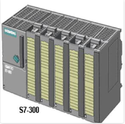

# CDU AND MSQ Unit of the Refinery

The production of the valuable petroleum products of the refinery goes through a series of different **primary** and **secondary** processing units along with the associated **auxiliary facilities** like Captive Power Plant installed within the refinery.

***Operation of the Crude Distillation Unit***

The primary unit of the Refinery is the Crude Distillation Unit (CDU).In this unit desalted crude from the desalter is heated up through a series of heat exchangers and is fed into a pre fractionator column.

Here the lighter gases, LPG and unstabilized gasoline are separated. The outputs from CDU are *gasoline, Kero-I, Kero-II and Straight Run Gas Oil*. *Reduced Coke Oil (RCO)* which is the bottom product from the main fractionating column, forms the main raw material for Coking unit and INDMAX. In Naphtha Splitter section, total Straight Run Naphtha is separated into three different fractions namely Light Naphtha (LN), Reformate Naphtha (RN) and Heavy Naphtha (HN).

As instrumentation engineers we usually don't deal with the core chemical processes involved in the Crude Distillation Unit rather we do the control operations using PLC(Programmable Logic Controller) and DCS(Distributed Control System).

***Operation of the Motor Spirit Quality Unit***

 *Objective* :

 * To split INDMAX gasoline and Wild Naphtha in the 3 cuts splitter and separate a heart cut stream .
 * To increase RON of Hydrotreated light naphtha cut in the Isomerization Unit.
 * To treat in NHDT , a mix of light naphtha heart cut from 3 cut splitter and straight Run Light naphtha in order to produce a sulphur free stable naphtha to feed the isomerization unit.

  NHDT SECTION : Purpose of this Naphtha Hydro desulphurization Unit is to protect Isomerization catalyst by eliminating or reducing to an acceptable level the impurity of naphtha . There are basically 2 fundamental reaction involve in this:

  1. Hydro refining
  2. Hydro generation HYROREFINING  DESULPHURIZATION

As instrumentation engineers we usually don't deal with the core chemical processes involved in the Crude Distillation Unit and Motor Spirit Quality Unit rather we do the control operations using PLC(Programmable Logic Controller) and DCS(Distributed Control System).

###  ***Programmable Logic Controller***

A PLC (Programmable Logic Controllers)  is an industrial computer used to monitor inputs, and depending upon their state make decisions based on its program or logic, to control (turn on/off) its outputs to automate a machine or a process.

Disadvantages of PLC control
* Too much work required in connecting wires.
* Difficulty with changes or replacements.
* Difficulty in finding errors; requiring skillful work force.
* When a problem occurs, hold-up time is indefinite, usually long.

Advantages of PLC control
* Rugged and designed to withstand vibrations, temperature, humidity, and noise.
* Have interfacing for inputs and outputs already inside the controller.
* Easily programmed and have an easily understood programming language.

*Terms associated with the operation of PLC*

1. Input Relays :
These are connected to the outside world. They physically exist and receive signals from switches, sensors, etc. Typically they are not relays but rather they are transistors.

2. Internal Utility Relays :
These do not receive signals from the outside world nor do they physically exist. They are simulated relays and are what enables a PLC to eliminate external relays.
There are also some special relays that are dedicated to performing only
one task.

3. Counters :
These do not physically exist. They are simulated counters and they can be programmed to count pulses.
Typically these counters can count up, down or both up and down. Since they are simulated they are limited in their counting speed.
Some manufacturers also include highspeed counters that are hardware based.

4. Timers :
These also do not physically exist. They come in many varieties and increments.
The most common type is an on-delay type.
Others include off-delay and both retentive and non-retentive types. Increments vary from 1ms through 1s.

5. Output Relays :
These are connected to the outside world. They physically exist and send on/off signals to solenoids, lights, etc.
They can be transistors, relays, or triacs depending upon the model chosen.

6. Data Storage :
Typically there are registers assigned to simply store data. Usually used as temporary storage for math or data manipulation.
They can also typically be used to store data when power is removed from the
PLC.

*Hardware Components of PLC*

1. Central Processing Unit (CPU) :
CPU – Microprocessor based, may allow arithmetic operations, logic operators, block memory moves, computer interface, local area network, functions, etc.
CPU makes a great number of check-ups of the PLC controller itself so eventual errors would be discovered early.

2. System Busses :
The internal paths along which the digital signals flow within the PLC are called
busses.
The system has four busses:
 *  The CPU uses the data bus for sending data between the different elements,
 *  The address bus to send the addresses of locations for accessing stored data,
 *  The control bus for signals relating to internal control actions,
 *  The system bus is used for communications between the I/O ports and the I/O unit.

3. Memory :
System (ROM) to give permanent storage for the operating system and the fixed data used by the CPU.
RAM for data. This is where information is stored on the status of input and output devices and the values of timers and counters and other internal devices. EPROM for ROM’s that can be programmed and then the program made permanent.

4. I/O Sections :
Inputs monitor field devices, such as switches and sensors.
Outputs control other devices, such as motors, pumps, solenoid valves, and lights.

5. Power Supply :
Most PLC controllers work either at 24 VDC or 220 VAC. Some PLC controllers have electrical supply as a separate module, while small and medium series already contain the supply module.

6. Programming Device :
The programming device is used to enter the required program into the memory of the processor.
The program is developed in the programming device and then transferred to the  memory unit of the PLC.

The PLC Programming in Guwahati Refinery is done via Functional Block Programming.

### ***Distributed Control System***

 The DCS s generally control and manage the *core* processes ( for eg. food, pharmaceutical, refining, etc.). PLCs are used to control *non-core* process functions including material handling, water treatment, motor controls, balance of plant operations, air compressor controls, packaging, and other functions.

 So DCS is distributed control and centralized monitoring system. In a Distributed Control System, the control function is distributed, but the monitoring is still centralized. All the n field inputs are not fed to a single CPU. Instead they are distributed among multiple CPU’s. In DCS terminology, CPU’s are referred as Field Control Stations (FCS).

 

 *Fig :Communication Between Field Instruments and PLC/DCS*

 ***Advantages of Distributed Control System***

* Control function is distributed among multiple CPUs (Field Control Stations).Hence
failure of one FCS does not affect the entire plant.
* Redundancy is available at various levels.
* Instruments and interlocks are created by software.
* Generation and modifications of the interlocks are very flexible and simple.
* Information regarding the process is presented to the user in various formats.
* Field wiring is considerably less.
* Maintenance and troubleshooting becomes very easy.
* Cost effective in the long run.

*Fig: Control Panel*
