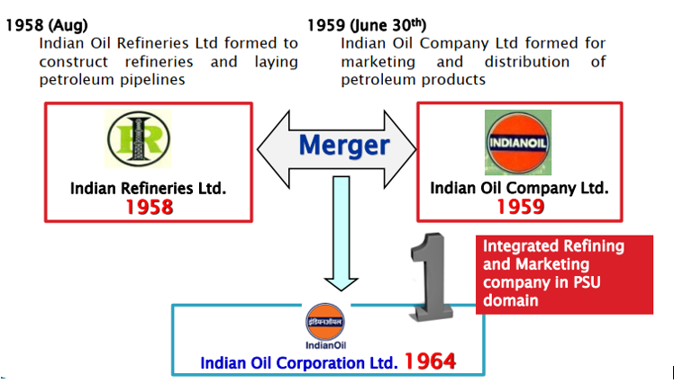

# About IOCL

***OVERVIEW*** :

Guwahati Refinery is the country's first Public Sector Refinery as well as Indian Oil's first Refinery serving the nation since 1962. Built with Rumanian assistance, the initial crude processing capacity at the time of commissioning of this Refinery was 0.75 MMTPA (Million Metric Tons Per Annum) and the Refinery was designed to process indigenous Assam Crude.

*Fig : Guwahati Refinery*

*Fig :Formation of Indian Oil*

Gradually, Guwahati Refinery started processing Low Sulfur Imported Crude along with Assam Crude from Barauni Refinery via railway wagons. The products of this refinery are LPG, Naphtha, Motor Spirit (MS), Aviation Turbine Fuel, Superior Kerosene Oil, High Speed Diesel (HSD), Raw Petroleum Coke and Sulfur. Out of these products Auto fuels MS and HSD supplied by the refinery are of eco-friendly BS-IV grade as per statutory guidelines of Government of India.
The production of these valuable petroleum products is through a series of different primary and secondary processing units along with the associated auxiliary facilities like Captive Power Plant installed within the refinery.

***Process Unit in Plant***
1. Crude Distillation Unit [CDU]
2. Delayed Coking Unit [DCU]
3. Kerosene Treating Unit [KTU]
4. Naphtha Splitter Facilities 1984 [NSF]
5. LPG Recovery Unit 1994 6> ISOSIV Unit 2002
7. INDMAX Unit 2003
8. Hydrogen Unit 2002
9. Diesel Hydrotreating Unit 2002
10. Sulphur Recovery Unit 2003 [SRU]
11. Nitrogen Unit 2002 [NU]

***Utilities of Guwahati Refinery***
* Thermal Power Station [TPS]
* De-mineralized Water Plant [DM Plant]
* Cooling Tower for Water
* Nitrogen Plant
* Hydrogen Generation Unit
* Compressed Air System
* Effluent Treatment Plant
