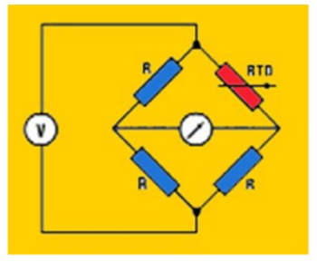
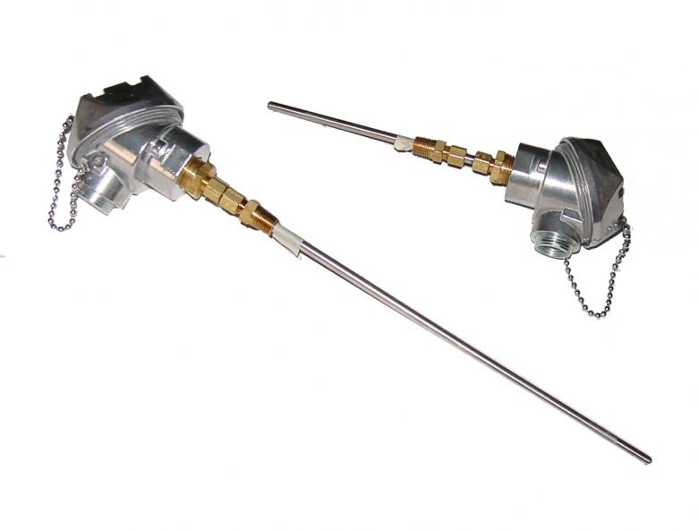
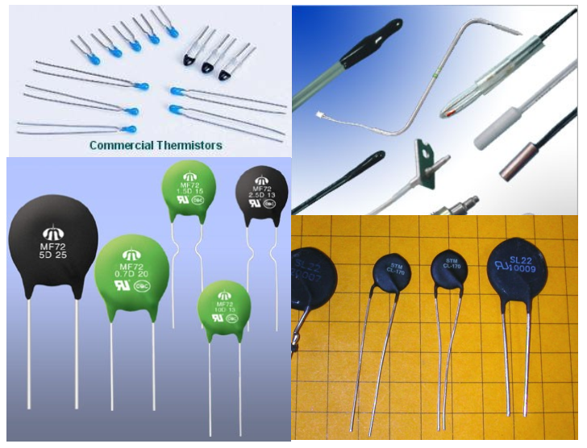

# Temperature Measurement

___Definition___ :
Temperature is a measure of the average kinetic energy of the particles that make up a body. The greater the kinetic energy of the particles is, the higher the temperature of the body will be or we can define temperature as the ability of one body to transfer thermal energy to another body i.e. If two bodies are in thermal equilibrium and no thermal energy is exchanged, the bodies are at the same temperature.

___Units of Measurement___

Heat is measured in Joules or Calories and Temperature is measured in Celsius and Fahrenheit.
S.I unit of Temperature is Kelvin.

Important Conversions:

°F = (9/5)°C + 32

°K = 273.15 + °C

___Why Temperature Measurement is necessary?___

Temperature is one of the most important measurement parameters that is used for monitoring and control in various industries.  Manufacturing processes that are affected by temperature are referred to as thermal systems.

___Types of Temperature Measuring Elements___
 1. _Mechanical_: Change of a fluid or solid volume (liquid-in-glass thermometer, bimetal thermometer, Filled- System thermometer)
 2. _Electrical_: Change in electrical quantity (Thermocouple, RTD, Radiation Thermometer)
 3. _Pyrometric_: Change in shape or color (color change indicators, melting indicators, pyrometric cones)
 4. _Others_: Specialized changes (semiconductor changes, IC thermometers)

___Different types of Temperature Measuring Instruments___

1. __Bimetallic Thermometers__
* Based on the principle that different metals
expand at different rates as they warm up.
* By bonding two different metals together, you
can make a simple electric controller that can
withstand fairly high temperatures.
* This sort of temperature element is found in
many mechanical temperature switches as
well as indicators.
* Strips of metals with different thermal
expansion coefficients are bonded
together at the same temperature
* When the temperature increase, the
assembly bends.
* When this happens, the metal strip
together with the larger temperature
coefficient of expansion expands
more than the other strip.
* The angular position-vs-temperature
relation is established by calibration
so you can use the device as a
thermometer.

 

 *Fig: Bimetallic Strip*

 • The bimetallic strip can be wound as a helix and will
twist when heated. This twisting action can be used to
drive a pointer over a calibrated temperature scale.
These temperature sensors are low cost and have
accuracy ranges of between 2-5% and are mostly used
for local readings. They are not suitable for providing a
continuous output measurement. These strips are often used in Temperature Gauges as shown below:

*Fig : Temperature Gauge with its cross section*

 2. __RTD (Resistive Temperature Detectors)__
* Change resistance in a linear relationship to
the applied heat
* Very accurate temperature vs resistance
characteristics and reproducible
* Excellent interchangeability and stability
* Can be used ass a temperature standard

*Fig : Circuit Diagram of a RTD*

* Materials used for RTD : Platinum, Nickel, Copper
* Temperature coefficient or alpha α is used by
the manufacturers to standardize the RTD’s
slope of TR curve
* The alpha describes the average resistance
change per unit temperature from the ice
point to the boiling point of water
* A Pt-100 and Pt-1000 have an α=0.00385

*Fig: Resistive Temperature Detector*

3. __Thermocouple__
* A thermocouple consists of two pieces of
dissimilar metals with their ends joined
together (by twisting, soldering or welding)
* Based on ___Seebeck Effect___ which simply states
that an electromotive force (emf) is created at
the junction of 2 dissimilar metals when
heated.

*Fig: Seebeck Effect*

* When heat is applied
to the junction of 2
dissimilar metals, a
voltage , in the range
of millivolts (mV), is
generated at the open
leads.

The mV per degree will depend on the combinations of metals used.
Manufacturers produce a variety of combinations specified as “types”
examples – Type T, J, K, E.

##### Thermocouple Types
* Manufacturers have perfected a variety of metal
combinations and specify them as “types”
Example -Type T, J, K, E
* Each produces its own specific mV per degree, these values
are published in the TC cables
* Each type has a different temperature range (Type T can only
measure up to 400°C, Type K 1300°C)
* The types are color coded to make it easy to identify them in
the field.

*Fig: Thermocouple*

4. __Thermistors__

* Thermally sensitive resistors that change
resistance with changes in temperature (in a
predictable manner).
* They are highly sensitive and have very
reproducible resistance vs temperature
properties.
* Typically used over a small temperature
range, (compared to other temperature
sensors) because of their non-linear
characteristics.
* Manufactured from oxides of nickel,
manganese, iron, cobalt, magnesium, titanium
and other metals.
* They are epoxy or glass encapsulated, or bare
bead, many of the standardized types are
color coded.
* Most thermistors exhibit a negative temperature
coefficient (NTC).
* Typically used over small temperature ranges.

*Fig: Different types of Thermistors*

## Temperature Transmitters

A temperature transmitter is a device that connects to a temperature sensor to transmit the signal elsewhere for monitoring and control purposes. Typically, the temperature sensor is either an RTD, Thermistor or Thermocouple type sensor and will interface with a PLC, DCS, data logger or display hardware.

The temperature transmitter's role is to isolate the temperature signal, filter any EMC noise, amplify and convert the temperature sensor's signal to a 4-20mA range for further use.

4-20ma temperature transmitters are common in manufacturing as the majority of industrial equipment communiciates via this signal range. The transmitted temperature signal can be scaled inside the temperature transmitter to accommodate the needs of the application, e.g. the 4mA can be used to represent -17.7°C (0° Fahrenheit) and the highest value in the range (20mA) can be used to represent 37.7° C (100° Fahrenheit)

*Fig : Temperature Transmitter*
